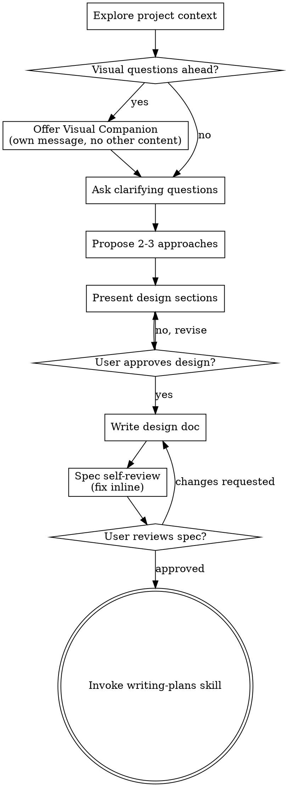

# 아이디어를 설계로 발전시키는 Brainstorming

자연스러운 협업 대화를 통해 아이디어를 완전한 설계와 스펙으로 발전시키는 과정입니다.

현재 프로젝트 맥락을 먼저 파악한 다음, 아이디어를 다듬기 위해 질문을 하나씩 제시합니다. 무엇을 만들지 이해한 후 설계를 제안하고 사용자 승인을 받습니다.

<HARD-GATE>
설계를 제시하고 사용자가 승인할 때까지 구현 스킬 호출, 코드 작성, 프로젝트 스캐폴딩, 또는 어떠한 구현 행동도 하지 않습니다. 이는 단순해 보이는 프로젝트를 포함한 모든 프로젝트에 적용됩니다.
</HARD-GATE>

## 안티패턴: "이건 너무 간단해서 설계가 필요 없어"

모든 프로젝트는 이 과정을 거칩니다. 할 일 목록, 단일 함수 유틸리티, 설정 변경 — 모두 해당됩니다. "단순한" 프로젝트야말로 검토되지 않은 가정이 가장 많은 낭비를 초래하는 곳입니다. 설계는 짧아도 됩니다(정말 단순한 프로젝트는 몇 문장으로 충분), 하지만 반드시 제시하고 승인을 받아야 합니다.

## 체크리스트

아래 항목 각각에 대해 작업을 생성하고 순서대로 완료해야 합니다:

1. **프로젝트 맥락 탐색** — 파일, 문서, 최근 커밋 확인
2. **비주얼 컴패니언 제안** (시각적 질문이 포함될 주제인 경우) — 명확화 질문과 합치지 않고 별도 메시지로 제시. 아래 Visual Companion 섹션 참조.
3. **명확화 질문** — 하나씩, 목적/제약/성공 기준 파악
4. **2-3가지 접근법 제안** — 트레이드오프와 권장 사항 포함
5. **설계 제시** — 복잡도에 맞게 섹션별로 나누어 제시, 각 섹션 후 사용자 승인 획득
6. **설계 문서 작성** — `_workspaces/{branch-slug}/design.md`에 저장 후 커밋
7. **스펙 자체 검토** — 플레이스홀더, 모순, 모호성, 범위에 대한 빠른 인라인 점검 (아래 참조)
8. **사용자의 작성된 스펙 검토** — 진행 전 사용자에게 스펙 파일 검토 요청
9. **구현으로 전환** — writing-plans 스킬을 호출하여 구현 계획 작성

## 프로세스 흐름

**최종 상태는 writing-plans 호출입니다.** frontend-design, mcp-builder, 또는 다른 구현 스킬을 호출하지 않습니다. brainstorming 후 호출하는 스킬은 writing-plans 하나뿐입니다.

## 프로세스

**아이디어 이해:**

- 먼저 현재 프로젝트 상태를 확인합니다 (파일, 문서, 최근 커밋)
- 세부 질문 전에 범위를 먼저 파악합니다: 요청이 여러 독립적인 서브시스템을 묘사하는 경우 (예: "채팅, 파일 저장, 결제, 분석이 있는 플랫폼 구축"), 즉시 이를 알립니다. 먼저 분해가 필요한 프로젝트의 세부 사항을 다듬는 데 질문을 소모하지 않습니다.
- 프로젝트가 단일 스펙에 비해 너무 크다면, 사용자가 서브 프로젝트로 분해할 수 있도록 도와줍니다: 독립적인 구성 요소는 무엇인지, 어떻게 연관되는지, 어떤 순서로 만들어야 하는지? 그런 다음 첫 번째 서브 프로젝트를 일반 설계 흐름으로 brainstorming합니다. 각 서브 프로젝트는 자체적인 스펙 → 계획 → 구현 사이클을 갖습니다.
- 적절한 범위의 프로젝트는 아이디어를 다듬기 위해 질문을 하나씩 제시합니다
- 가능하면 객관식 질문을 선호하지만, 주관식도 괜찮습니다
- 메시지당 질문 하나 — 주제에 더 많은 탐색이 필요하다면 여러 질문으로 나눕니다
- 목적, 제약 조건, 성공 기준 이해에 집중합니다

**접근법 탐색:**

- 트레이드오프를 포함한 2-3가지 다른 접근법을 제안합니다
- 권장 사항과 이유를 포함하여 대화형으로 옵션을 제시합니다
- 권장 옵션을 먼저 제시하고 이유를 설명합니다

**설계 제시:**

- 무엇을 만들지 이해했다고 판단되면 설계를 제시합니다
- 각 섹션을 복잡도에 맞게 조정합니다: 간단하면 몇 문장, 복잡하면 200-300단어까지
- 각 섹션 후 지금까지 괜찮은지 확인합니다
- 다음 내용을 다룹니다: 아키텍처, 컴포넌트, 데이터 흐름, 에러 처리, 테스트
- 이해되지 않는 부분이 있으면 언제든지 돌아가서 명확히 할 준비를 합니다

**격리와 명확성을 위한 설계:**

- 시스템을 각각 하나의 명확한 목적을 가지고, 잘 정의된 인터페이스로 소통하며, 독립적으로 이해하고 테스트할 수 있는 더 작은 단위로 분해합니다
- 각 단위에 대해 답할 수 있어야 합니다: 무엇을 하는가, 어떻게 사용하는가, 무엇에 의존하는가?
- 내부를 읽지 않고도 단위가 무엇을 하는지 이해할 수 있나요? 소비자를 깨뜨리지 않고 내부를 변경할 수 있나요? 그렇지 않다면 경계를 재검토해야 합니다.
- 더 작고 경계가 명확한 단위는 작업하기도 더 쉽습니다 — 한 번에 컨텍스트에 담을 수 있는 코드에 대해 더 잘 추론하고, 파일이 집중되어 있을 때 편집이 더 신뢰할 수 있습니다. 파일이 커질 때, 그것은 종종 너무 많은 일을 하고 있다는 신호입니다.

**기존 코드베이스에서 작업:**

- 변경을 제안하기 전에 현재 구조를 탐색합니다. 기존 패턴을 따릅니다.
- 작업에 영향을 미치는 기존 코드 문제가 있는 경우 (예: 너무 커진 파일, 불명확한 경계, 얽힌 책임), 작업 중인 코드를 개선하는 좋은 개발자처럼 설계의 일부로 목표한 개선을 포함합니다.
- 관련 없는 리팩터링은 제안하지 않습니다. 현재 목표에 기여하는 것에 집중합니다.

## 설계 이후

**문서화:**

- 검증된 설계(스펙)를 `_workspaces/{branch-slug}/design.md`에 작성합니다
  - (스펙 위치에 대한 사용자 설정이 이 기본값보다 우선합니다)
- 가능하다면 elements-of-style:writing-clearly-and-concisely 스킬을 사용합니다
- 설계 문서를 git에 커밋합니다

**스펙 자체 검토:**
스펙 문서를 작성한 후, 새로운 눈으로 검토합니다:

1. **플레이스홀더 스캔:** "TBD", "TODO", 불완전한 섹션, 또는 모호한 요구사항이 있나요? 수정합니다.
2. **내부 일관성:** 섹션들이 서로 모순되지 않나요? 아키텍처가 기능 설명과 일치하나요?
3. **범위 확인:** 단일 구현 계획에 충분히 집중되어 있나요, 아니면 분해가 필요한가요?
4. **모호성 확인:** 요구사항이 두 가지로 해석될 수 있나요? 그렇다면 하나를 선택하고 명시합니다.

인라인으로 문제를 수정합니다. 재검토는 불필요 — 수정하고 계속 진행합니다.

**사용자 검토 게이트:**
스펙 검토 루프가 통과된 후, 진행 전 사용자에게 작성된 스펙을 검토하도록 요청합니다:

> "Spec written and committed to `<path>`. Please review it and let me know if you want to make any changes before we start writing out the implementation plan."

사용자의 응답을 기다립니다. 변경을 요청하면 수정하고 스펙 검토 루프를 다시 실행합니다. 사용자가 승인한 후에만 진행합니다.

**구현:**

- writing-plans 스킬을 호출하여 상세 구현 계획을 작성합니다
- 다른 스킬은 호출하지 않습니다. writing-plans가 다음 단계입니다.

## 핵심 원칙

- **한 번에 하나의 질문** — 여러 질문으로 부담을 주지 않습니다
- **객관식 선호** — 가능하면 주관식보다 답하기 쉬운 객관식을 사용합니다
- **YAGNI 철저히** — 모든 설계에서 불필요한 기능을 제거합니다
- **대안 탐색** — 결정 전 항상 2-3가지 접근법을 제안합니다
- **점진적 검증** — 설계를 제시하고, 계속 진행하기 전에 승인을 받습니다
- **유연성 유지** — 이해되지 않는 부분이 있으면 돌아가서 명확히 합니다

## Visual Companion

brainstorming 중 목업, 다이어그램, 시각적 옵션을 보여주기 위한 브라우저 기반 컴패니언입니다. 모드가 아닌 도구로 사용합니다. 컴패니언을 수락한다는 것은 시각적 처리가 도움이 되는 질문에 사용할 수 있다는 의미입니다; 모든 질문이 브라우저를 통해 이루어진다는 의미가 아닙니다.

**컴패니언 제안:** 앞으로의 질문에 시각적 내용 (목업, 레이아웃, 다이어그램)이 포함될 것으로 예상될 때, 동의를 구하기 위해 한 번 제안합니다:

> "Some of what we're working on might be easier to explain if I can show it to you in a web browser. I can put together mockups, diagrams, comparisons, and other visuals as we go. This feature is still new and can be token-intensive. Want to try it? (Requires opening a local URL)"

**이 제안은 반드시 별도의 메시지여야 합니다.** 명확화 질문, 맥락 요약, 또는 다른 내용과 합치지 않습니다. 메시지에는 위의 제안만 포함해야 합니다. 계속 진행하기 전에 사용자의 응답을 기다립니다. 거절하면 텍스트 전용 brainstorming으로 진행합니다.

**질문별 결정:** 사용자가 수락한 후에도, 각 질문마다 브라우저를 사용할지 터미널을 사용할지 결정합니다. 기준: **사용자가 읽는 것보다 보는 것이 더 잘 이해할 수 있는가?**

- **브라우저 사용** — 시각적 내용: 목업, 와이어프레임, 레이아웃 비교, 아키텍처 다이어그램, 나란히 놓은 시각적 설계
- **터미널 사용** — 텍스트 내용: 요구사항 질문, 개념적 선택, 트레이드오프 목록, A/B/C/D 텍스트 옵션, 범위 결정

UI 주제에 대한 질문이 자동으로 시각적 질문인 것은 아닙니다. "이 맥락에서 개성이란 무엇을 의미하나요?"는 개념적 질문 — 터미널을 사용합니다. "어떤 마법사 레이아웃이 더 좋나요?"는 시각적 질문 — 브라우저를 사용합니다.

사용자가 컴패니언에 동의하면, 진행 전 상세 가이드를 읽습니다:
`skills/brainstorming/visual-companion.md`
