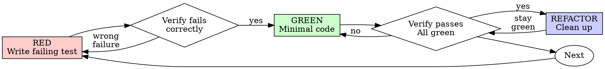

# 테스트 주도 개발 (TDD)

## 개요

테스트를 먼저 작성하라. 실패하는 것을 확인하라. 통과시키기 위한 최소한의 코드를 작성하라.

**핵심 원칙:** 테스트가 실패하는 것을 직접 확인하지 않으면, 해당 테스트가 올바른 것을 테스트하는지 알 수 없다.

**규칙의 문자를 위반하는 것은 규칙의 정신을 위반하는 것이다.**

## 사용 시점

**항상:**

- 새로운 기능
- 버그 수정
- 리팩터링
- 동작 변경

**예외 (파트너에게 확인):**

- 폐기용 프로토타입
- 자동 생성 코드
- 설정 파일

"이번 한 번만 TDD를 건너뛰자"라는 생각이 드는가? 멈춰라. 그것은 합리화다.

## 철칙

```
실패하는 테스트 없이 프로덕션 코드 작성 금지
```

테스트 전에 코드를 작성했는가? 삭제하라. 처음부터 시작하라.

**예외 없음:**

- "참고용"으로 보관 금지
- 테스트를 작성하면서 "적용"하는 것 금지
- 참조하는 것 금지
- 삭제는 삭제를 의미함

테스트로부터 새롭게 구현하라. 이상.

## Red-Green-Refactor



### RED - 실패하는 테스트 작성

무엇이 일어나야 하는지 보여주는 최소한의 테스트 하나를 작성하라.

<Good>
```typescript
test('retries failed operations 3 times', async () => {
  let attempts = 0;
  const operation = () => {
    attempts++;
    if (attempts < 3) throw new Error('fail');
    return 'success';
  };

const result = await retryOperation(operation);

expect(result).toBe('success');
expect(attempts).toBe(3);
});

````
명확한 이름, 실제 동작 테스트, 단일 책임
</Good>

<Bad>
```typescript
test('retry works', async () => {
  const mock = jest.fn()
    .mockRejectedValueOnce(new Error())
    .mockRejectedValueOnce(new Error())
    .mockResolvedValueOnce('success');
  await retryOperation(mock);
  expect(mock).toHaveBeenCalledTimes(3);
});
````

모호한 이름, 코드가 아닌 모킹을 테스트
</Bad>

**요건:**

- 단일 동작
- 명확한 이름
- 실제 코드 (불가피한 경우에만 모킹)

### RED 검증 - 실패하는 것을 직접 확인

**필수. 절대 건너뛰지 말 것.**

```bash
npm test path/to/test.test.ts
```

확인 사항:

- 테스트가 실패함 (오류가 아닌 실패)
- 실패 메시지가 예상한 것임
- 기능이 없어서 실패함 (오타가 아닌)

**테스트가 통과하는가?** 기존 동작을 테스트하고 있는 것. 테스트를 수정하라.

**테스트에 오류가 발생하는가?** 오류를 수정하고, 올바르게 실패할 때까지 재실행하라.

### GREEN - 최소한의 코드

테스트를 통과시키기 위한 가장 간단한 코드를 작성하라.

<Good>
```typescript
async function retryOperation<T>(fn: () => Promise<T>): Promise<T> {
  for (let i = 0; i < 3; i++) {
    try {
      return await fn();
    } catch (e) {
      if (i === 2) throw e;
    }
  }
  throw new Error('unreachable');
}
```
통과에 필요한 최소한
</Good>

<Bad>
```typescript
async function retryOperation<T>(
  fn: () => Promise<T>,
  options?: {
    maxRetries?: number;
    backoff?: 'linear' | 'exponential';
    onRetry?: (attempt: number) => void;
  }
): Promise<T> {
  // YAGNI
}
```
과도한 설계
</Bad>

기능을 추가하거나, 다른 코드를 리팩터링하거나, 테스트 범위를 넘어 "개선"하지 말 것.

### GREEN 검증 - 통과하는 것을 직접 확인

**필수.**

```bash
npm test path/to/test.test.ts
```

확인 사항:

- 테스트가 통과함
- 다른 테스트들도 여전히 통과함
- 출력이 깨끗함 (오류, 경고 없음)

**테스트가 실패하는가?** 테스트가 아닌 코드를 수정하라.

**다른 테스트가 실패하는가?** 지금 수정하라.

### REFACTOR - 정리

GREEN 이후에만:

- 중복 제거
- 이름 개선
- 헬퍼 추출

테스트를 GREEN으로 유지하라. 동작을 추가하지 말 것.

### 반복

다음 기능을 위한 다음 실패 테스트로.

## 좋은 테스트

| 품질          | 좋은 예                                     | 나쁜 예                                             |
| ------------- | ------------------------------------------- | --------------------------------------------------- |
| **최소화**    | 한 가지만. 이름에 "and"가 있으면? 분리하라. | `test('validates email and domain and whitespace')` |
| **명확성**    | 이름이 동작을 설명함                        | `test('test1')`                                     |
| **의도 표현** | 원하는 API를 보여줌                         | 코드가 무엇을 해야 하는지 불명확                    |

## 순서가 중요한 이유

**"코드 작성 후 테스트로 동작을 검증할 것이다"**

코드 작성 후 작성된 테스트는 즉시 통과한다. 즉시 통과하는 것은 아무것도 증명하지 않는다:

- 잘못된 것을 테스트할 수 있음
- 동작이 아닌 구현을 테스트할 수 있음
- 잊어버린 엣지 케이스를 놓칠 수 있음
- 버그를 잡는 것을 한 번도 보지 못한 것

테스트 선행은 테스트가 실패하는 것을 보게 강제하며, 실제로 무언가를 테스트한다는 것을 증명한다.

**"이미 모든 엣지 케이스를 수동으로 테스트했다"**

수동 테스트는 임시방편이다. 모든 것을 테스트했다고 생각하지만:

- 테스트한 것의 기록이 없음
- 코드가 변경될 때 재실행할 수 없음
- 압박 하에 케이스를 잊기 쉬움
- "시도했을 때 작동했다" ≠ 포괄적

자동화된 테스트는 체계적이다. 매번 동일한 방식으로 실행된다.

**"X시간의 작업을 삭제하는 것은 낭비다"**

매몰 비용 오류. 그 시간은 이미 지나갔다. 지금 당신의 선택:

- 삭제하고 TDD로 재작성 (X시간 더, 높은 신뢰도)
- 유지하고 나중에 테스트 추가 (30분, 낮은 신뢰도, 버그 가능성)

"낭비"는 신뢰할 수 없는 코드를 유지하는 것이다. 실제 테스트 없는 작동하는 코드는 기술 부채다.

**"TDD는 교조적이다, 실용적이라는 것은 적응하는 것을 의미한다"**

TDD가 실용적인 것이다:

- 커밋 전에 버그를 발견함 (이후 디버깅보다 빠름)
- 회귀를 방지함 (테스트가 즉시 깨짐을 잡아냄)
- 동작을 문서화함 (테스트가 코드 사용법을 보여줌)
- 리팩터링을 가능하게 함 (자유롭게 변경, 테스트가 깨짐을 잡아냄)

"실용적인" 지름길 = 프로덕션에서 디버깅 = 더 느림.

**"나중에 테스트해도 동일한 목표 달성 - 의식이 아닌 정신이 중요하다"**

아니다. 나중에 작성된 테스트는 "이것이 무엇을 하는가?"에 답한다. 먼저 작성된 테스트는 "이것이 무엇을 해야 하는가?"에 답한다.

나중에 작성된 테스트는 구현에 편향된다. 필요한 것이 아닌 만든 것을 테스트한다. 발견된 케이스가 아닌 기억된 엣지 케이스를 검증한다.

테스트 선행은 구현 전에 엣지 케이스 발견을 강제한다. 테스트 후행은 모든 것을 기억했는지 검증한다 (기억하지 못했을 것이다).

30분의 나중 테스트 ≠ TDD. 커버리지는 얻지만, 테스트가 작동한다는 증거는 잃는다.

## 흔한 합리화

| 변명                                          | 현실                                                                             |
| --------------------------------------------- | -------------------------------------------------------------------------------- |
| "테스트하기엔 너무 간단하다"                  | 간단한 코드도 깨진다. 테스트 작성에 30초.                                        |
| "나중에 테스트할 것이다"                      | 즉시 통과하는 테스트는 아무것도 증명하지 않는다.                                 |
| "나중에 테스트해도 같은 목표 달성"            | 테스트 후행 = "이것이 무엇을 하는가?" 테스트 선행 = "이것이 무엇을 해야 하는가?" |
| "이미 수동으로 테스트했다"                    | 임시방편 ≠ 체계적. 기록 없음, 재실행 불가.                                       |
| "X시간 삭제는 낭비다"                         | 매몰 비용 오류. 검증되지 않은 코드 유지가 기술 부채.                             |
| "참고용으로 유지하고, 테스트 먼저 작성하겠다" | 적용하게 될 것이다. 그것이 나중에 테스트하는 것이다. 삭제는 삭제를 의미한다.     |
| "먼저 탐색할 필요가 있다"                     | 괜찮다. 탐색 코드를 버리고, TDD로 시작하라.                                      |
| "테스트하기 어렵다 = 설계가 불명확하다"       | 테스트에 귀를 기울여라. 테스트하기 어렵다 = 사용하기 어렵다.                     |
| "TDD가 나를 느리게 할 것이다"                 | TDD가 디버깅보다 빠르다. 실용적 = 테스트 선행.                                   |
| "수동 테스트가 더 빠르다"                     | 수동으로 엣지 케이스가 증명되지 않는다. 매 변경마다 재테스트해야 한다.           |
| "기존 코드에 테스트가 없다"                   | 개선 중인 것이다. 기존 코드에 테스트를 추가하라.                                 |

## 위험 신호 - 멈추고 처음부터 시작하라

- 테스트 전에 코드 작성
- 구현 후 테스트
- 테스트가 즉시 통과
- 테스트가 왜 실패했는지 설명 불가
- "나중에" 추가된 테스트
- "이번 한 번만" 합리화
- "이미 수동으로 테스트했다"
- "나중에 테스트해도 같은 목적 달성"
- "의식이 아닌 정신이 중요하다"
- "참고용으로 유지" 또는 "기존 코드를 적용"
- "이미 X시간을 썼고, 삭제는 낭비다"
- "TDD는 교조적이다, 나는 실용적으로 행동한다"
- "이건 다르다. 왜냐하면..."

**이 모든 것은 다음을 의미한다: 코드를 삭제하라. TDD로 처음부터 시작하라.**

## 예시: 버그 수정

**버그:** 빈 이메일이 허용됨

**RED**

```typescript
test("rejects empty email", async () => {
  const result = await submitForm({ email: "" });
  expect(result.error).toBe("Email required");
});
```

**RED 검증**

```bash
$ npm test
FAIL: expected 'Email required', got undefined
```

**GREEN**

```typescript
function submitForm(data: FormData) {
  if (!data.email?.trim()) {
    return { error: "Email required" };
  }
  // ...
}
```

**GREEN 검증**

```bash
$ npm test
PASS
```

**REFACTOR**
필요한 경우 여러 필드에 대한 유효성 검사를 추출하라.

## 검증 체크리스트

작업 완료 전:

- [ ] 모든 새로운 함수/메서드에 테스트가 있음
- [ ] 구현 전에 각 테스트가 실패하는 것을 확인함
- [ ] 각 테스트가 예상한 이유로 실패함 (기능 없음, 오타 아님)
- [ ] 각 테스트를 통과시키기 위한 최소한의 코드를 작성함
- [ ] 모든 테스트가 통과함
- [ ] 출력이 깨끗함 (오류, 경고 없음)
- [ ] 테스트가 실제 코드를 사용함 (불가피한 경우에만 모킹)
- [ ] 엣지 케이스와 오류가 커버됨

모든 항목을 체크할 수 없는가? TDD를 건너뛴 것이다. 처음부터 시작하라.

## 막혔을 때

| 문제                  | 해결책                                                            |
| --------------------- | ----------------------------------------------------------------- |
| 테스트 방법을 모름    | 원하는 API를 작성하라. 단언을 먼저 작성하라. 파트너에게 질문하라. |
| 테스트가 너무 복잡함  | 설계가 너무 복잡한 것. 인터페이스를 단순화하라.                   |
| 모든 것을 모킹해야 함 | 코드가 너무 결합된 것. 의존성 주입을 사용하라.                    |
| 테스트 설정이 방대함  | 헬퍼를 추출하라. 여전히 복잡한가? 설계를 단순화하라.              |

## 디버깅 통합

버그를 발견했는가? 재현하는 실패 테스트를 작성하라. TDD 사이클을 따르라. 테스트는 수정을 증명하고 회귀를 방지한다.

테스트 없이 버그를 수정하지 말 것.

## 테스트 안티패턴

모킹이나 테스트 유틸리티를 추가할 때, 흔한 함정을 피하기 위해 @testing-anti-patterns.md를 읽어라:

- 실제 동작 대신 모킹 동작을 테스트하는 것
- 프로덕션 클래스에 테스트 전용 메서드를 추가하는 것
- 의존성을 이해하지 않고 모킹하는 것

## 최종 규칙

```
프로덕션 코드 → 테스트가 존재하고 먼저 실패했음
그렇지 않으면 → TDD가 아님
```

파트너의 허가 없이는 예외 없음.
