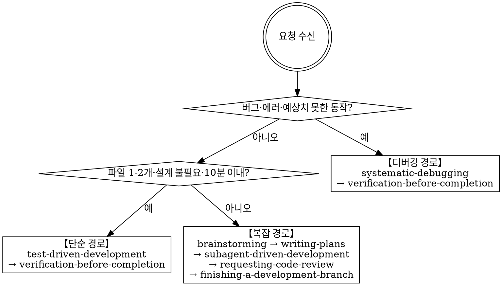
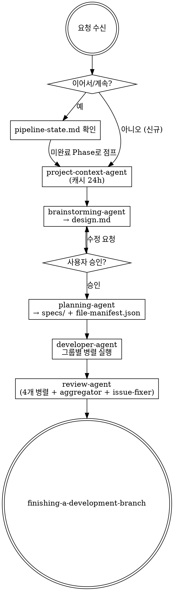
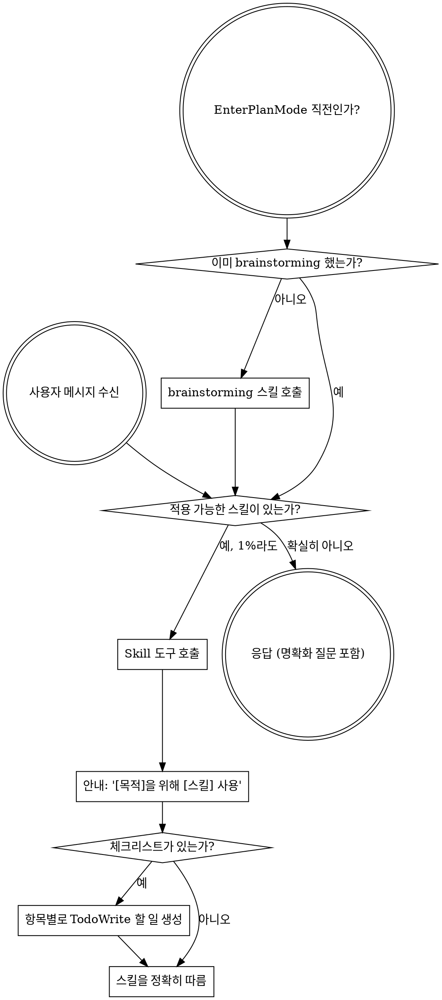

<SUBAGENT-STOP>
서브에이전트로 파견되어 특정 작업을 수행 중이라면, 이 스킬을 건너뜁니다.
</SUBAGENT-STOP>

<EXTREMELY-IMPORTANT>
현재 작업에 어떤 스킬이 적용될 가능성이 1%라도 있다면, 반드시 해당 스킬을 호출해야 합니다.

스킬이 작업에 해당된다면 선택의 여지가 없습니다. 반드시 사용해야 합니다.

이것은 협상 불가입니다. 선택 사항이 아닙니다. 스스로 합리화하여 빠져나갈 수 없습니다.
</EXTREMELY-IMPORTANT>

## 지침 우선순위

forge 스킬은 기본 시스템 프롬프트 동작을 재정의하지만, **사용자 지침이 항상 최우선입니다**:

1. **사용자의 명시적 지침** (CLAUDE.md, GEMINI.md, AGENTS.md, 직접 요청) — 최고 우선순위
2. **forge 스킬** — 충돌 시 기본 시스템 동작 재정의
3. **기본 시스템 프롬프트** — 최저 우선순위

CLAUDE.md, GEMINI.md, AGENTS.md에 "TDD 사용 금지"라고 명시되어 있고 스킬이 "항상 TDD 사용"을 요구하면, 사용자 지침을 따릅니다. 사용자가 주도권을 가집니다.

## 스킬 접근 방법

**Claude Code에서:** `Skill` 도구를 사용합니다. 스킬을 호출하면 해당 내용이 로드되어 제공됩니다 — 그대로 따릅니다. 스킬 파일에 Read 도구를 사용하지 않습니다.

**Copilot CLI에서:** `skill` 도구를 사용합니다. 스킬은 설치된 플러그인에서 자동으로 검색됩니다. `skill` 도구는 Claude Code의 `Skill` 도구와 동일하게 작동합니다.

**Gemini CLI에서:** 스킬은 `activate_skill` 도구로 활성화됩니다. Gemini는 세션 시작 시 스킬 메타데이터를 로드하고, 요청 시 전체 내용을 활성화합니다.

**다른 환경에서:** 스킬이 로드되는 방법은 해당 플랫폼 문서를 확인합니다.

## 플랫폼 적응

스킬은 Claude Code 도구 이름을 사용합니다. 비 CC 플랫폼의 경우: 도구 매핑은 `references/copilot-tools.md` (Copilot CLI), `references/codex-tools.md` (Codex)를 참조합니다. Gemini CLI 사용자는 GEMINI.md를 통해 도구 매핑이 자동으로 로드됩니다.

# 스킬 사용법

## 요청 유형 판단 및 파이프라인 경로

모든 요청을 받으면, skill을 호출하기 전에 먼저 요청 유형을 판단하여 적절한 파이프라인 경로를 선택합니다.



### 단순 작업 판단 기준

다음을 **모두** 충족해야 단순 경로로 처리합니다:

- 수정 파일 1-2개
- 어떻게 구현할지 이미 명확 (설계 결정 불필요)
- 10분 이내 구현 가능
- 기존 패턴 그대로 사용, 새 아키텍처 불필요
- 외부 의존성 추가 없음

**하나라도 해당하면 즉시 복잡 경로로 전환:**

- 신규 기능 또는 서브시스템 도입
- 여러 파일 연동 또는 인터페이스 설계 필요
- 아키텍처·기술 선택 결정 필요
- 요구사항 모호 또는 접근법 선택 필요
- 외부 의존성 추가

### 파이프라인별 실행 시퀀스

**단순 경로:**

1. `forge:test-driven-development` — RED-GREEN-REFACTOR 사이클로 직접 구현
2. `forge:verification-before-completion` — 완료 전 실제 동작 검증

**복잡 경로 (subagent 파이프라인):**



Phase별 실행 상세:

| Phase | 에이전트                               | 입력                          | 출력                                               |
| ----- | -------------------------------------- | ----------------------------- | -------------------------------------------------- |
| 0     | `project-context-agent`                | 프로젝트 루트                 | `_workspaces/project-context.md` (24h 캐시)        |
| 1     | `brainstorming-agent`                  | 요구사항 + project-context.md | `_workspaces/{branch-slug}/design.md` → 사용자 승인       |
| 2     | `planning-agent`                       | design.md                     | `_workspaces/{branch-slug}/specs/` + `file-manifest.json` |
| 3     | `developer-agent` × N                  | spec 파일 (그룹별 병렬)       | 코드 + 커밋 (TDD) + `HANDOFF.md` (spec/phase 완료 시) |
| 4     | `review-agent`                         | 브랜치 diff                   | `_workspaces/{branch-slug}/review-report.md`              |
| 5     | `finishing-a-development-branch` skill | —                             | merge/PR/유지/폐기                                 |

### 부분 재실행

"이어서", "계속", "리뷰부터 다시" 요청 시 처음부터 재시작하지 않고 미완료 Phase부터 재시작합니다.

이어받을 때 `_workspaces/{branch-slug}/HANDOFF.md`(있으면)를 먼저 읽어 "어디까지·왜·다음은" 맥락을 복원합니다. pipeline-state.md가 기계적 Phase 상태라면, HANDOFF.md는 그 위의 서술형 인계 맥락입니다.

`_workspaces/{branch-slug}/pipeline-state.md`로 Phase 완료 상태 추적:

```markdown
## Pipeline State: {branch-slug}

- [x] Phase 0: project-context
- [x] Phase 1: brainstorming (design.md 승인 완료)
- [x] Phase 2: planning
- [ ] Phase 3: development ← 여기서 중단됨
- [ ] Phase 4: review
- [ ] Phase 5: finishing
```

재실행 판단 기준:

| 사용자 표현       | 처리                                                             |
| ----------------- | ---------------------------------------------------------------- |
| "이어서", "계속"  | pipeline-state.md 확인 → 미완료 Phase부터                        |
| "리뷰부터 다시"   | Phase 4부터 재시작                                               |
| "설계 다시"       | Phase 1부터 재시작                                               |
| "새 요구사항으로" | 기존 `_workspaces/{branch-slug}/`를 `{branch-slug}_prev/`로 백업 → 전체 재시작 |

### 병렬 개발 그룹화

`file-manifest.json`의 `developmentOrder` 그룹 순서대로 실행합니다:

- **같은 그룹**: `developer-agent`를 단일 응답에 동시 호출 (병렬)
- **다른 그룹**: 이전 그룹 완료 후 다음 그룹 시작 (의존성 보장)

```
그룹 1: [spec-a.md] → developer-agent 호출
그룹 2: [spec-b.md, spec-c.md] → developer-agent 2개 동시 호출 (병렬)
그룹 3: [spec-d.md] → developer-agent 호출
```

**디버깅 경로:**

1. `forge:systematic-debugging` — 근본 원인 4단계 분석
2. `forge:verification-before-completion` — 수정 검증

---

## 규칙

**관련되거나 요청된 스킬을 응답이나 행동 전에 먼저 호출합니다.** 스킬이 적용될 가능성이 1%라도 있으면 호출하여 확인합니다. 호출한 스킬이 상황에 맞지 않다면 사용하지 않아도 됩니다.



## 위험 신호

다음 생각이 든다면 멈추세요 — 합리화하고 있는 것입니다:

| 생각                               | 현실                                                            |
| ---------------------------------- | --------------------------------------------------------------- |
| "이건 단순한 질문일 뿐이야"        | 질문도 작업입니다. 스킬을 확인합니다.                           |
| "먼저 맥락이 더 필요해"            | 스킬 확인은 명확화 질문보다 먼저 합니다.                        |
| "코드베이스를 먼저 탐색해야 해"    | 스킬이 탐색 방법을 알려줍니다. 먼저 확인합니다.                 |
| "git/파일을 빠르게 확인할 수 있어" | 파일에는 대화 맥락이 없습니다. 스킬을 확인합니다.               |
| "먼저 정보를 수집해야 해"          | 스킬이 정보 수집 방법을 알려줍니다.                             |
| "공식적인 스킬이 필요 없어"        | 스킬이 존재하면 사용합니다.                                     |
| "이 스킬을 기억하고 있어"          | 스킬은 진화합니다. 현재 버전을 읽습니다.                        |
| "이건 작업이 아니야"               | 행동 = 작업. 스킬을 확인합니다.                                 |
| "스킬은 과도해"                    | 단순한 것도 복잡해집니다. 사용합니다.                           |
| "이것 하나만 먼저 할게"            | 무엇을 하기 전에 먼저 확인합니다.                               |
| "이게 생산적인 것 같아"            | 훈련되지 않은 행동은 시간을 낭비합니다. 스킬이 이를 방지합니다. |
| "그 의미를 알고 있어"              | 개념을 아는 것 ≠ 스킬 사용. 호출합니다.                         |

## 스킬 우선순위

여러 스킬이 적용 가능한 경우, 다음 순서를 따릅니다:

1. **프로세스 스킬 우선** (brainstorming, debugging) — 작업 접근 방법을 결정합니다
2. **구현 스킬 다음** (frontend-design, mcp-builder) — 실행을 안내합니다

"X를 만들어보자" → brainstorming 먼저, 그 다음 구현 스킬.
"이 버그를 수정해" → debugging 먼저, 그 다음 도메인별 스킬.

## 스킬 유형

**엄격형** (TDD, debugging): 정확히 따릅니다. 규율에서 벗어나지 않습니다.

**유연형** (패턴): 원칙을 맥락에 맞게 적용합니다.

스킬 자체가 어느 유형인지 알려줍니다.

## 사용자 지침

지침은 무엇을 할지를 말하며, 방법은 아닙니다. "X를 추가해" 또는 "Y를 수정해"라고 해서 워크플로우를 건너뛰라는 의미가 아닙니다.
